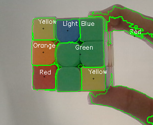

## Live Video Colour Detection
Color detection is mostly in demand in computer vision. A color detection algorithm detects pixels and matches a specific color. 'Video color detection' plays a crucial role in detecting live colors nowadays as driver-less cars are in demand.

### Information about Library Used

  
<b>OpenCV</b>

  
<b>OpenCV</b> library is used in real-time computer visoin . It mainly focuses on Image Processing,Video Capture and has features like face-detection,color-detection.

  
<b>Numpy</b>

  
<b>Numpy</b> library is a Python library used for working with arrays. It also has functions for working in domain of linear algebra, fourier transform, and matrices

  
<b>imutils</b>

  
<b>imutils</b> are a series of convenience functions to make basic image processing functions such as translation, rotation, resizing, skeletonization, and displaying Matplotlib images easier with OpenCV

### How to Run Program
<b>Step 1: Open py file from [here](https://github.com/Krutik4421/Live-Video-Colour-detection/blob/main/live-video-colour-detection.py)</b>

<b>Step 2: Run it in any python compiler and it will open camera ,place any object in front of camera of which you want to detect color.</b>

### Output

### To Contribute to the Project:

1. Choose any open issue from [here](https://github.com/Krutik4421/Live-Video-Colour-detection/issues). 
2. Comment on the Issue: `Can I work on this?` and Start Exploring it.
3. Make changes to your Fork and Send a PR.

### To Create a PR (Pull Request):

For Creating Valid PR Successfully. Kindly follow Guide: https://help.github.com/articles/creating-a-pull-request/

### To Send a PR, Follow Rules Carefully !!   

**Otherwise your PR will be Closed**:

1. For Appropriate PR, follow Title Format: `Fixes #IssueNo : Name of the Issue`

For any Doubts related to the Issues, such as understanding Issue better etc., Comment Down your Queries on the Respective Issue.
